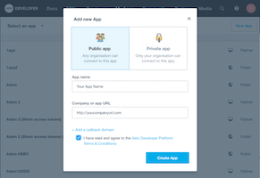
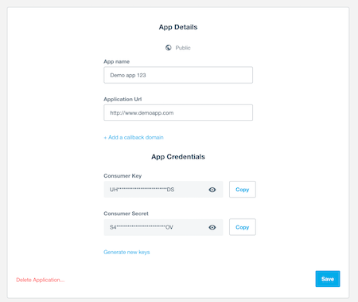
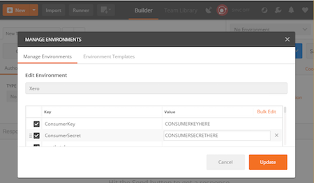
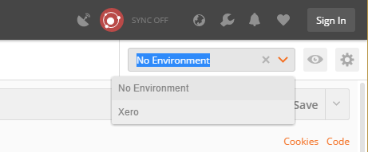
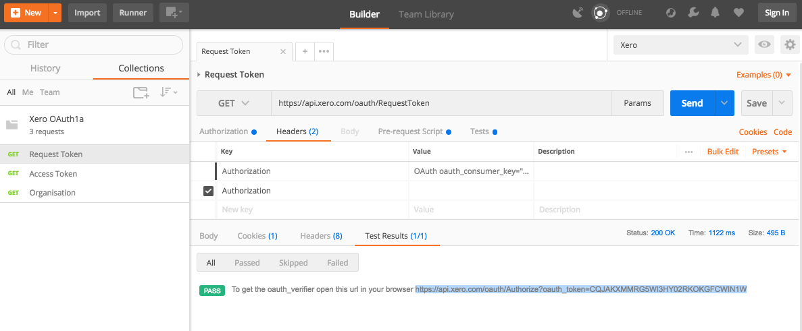
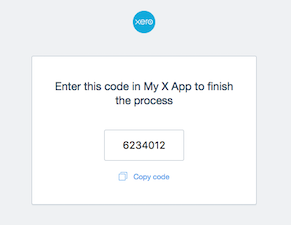
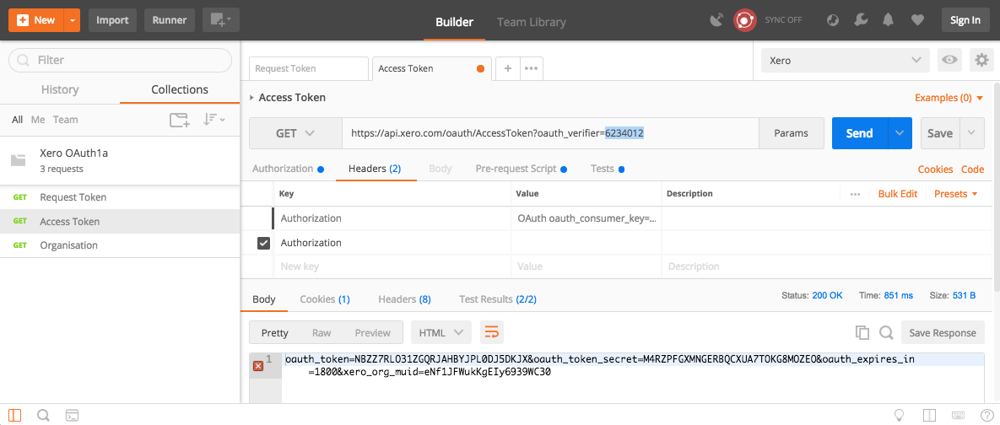

# Xero-Postman OAuth 2.0
A Postman collection for authenticating to the Xero API. 

## Steps to get up and running
Follow these steps to quickly get up and running with the Xero API and Postman:

### 1. Import the Xero OAuth 2.0 collection and Xero environment into Postman
Click the button below and select the Desktop version of Postman (Chrome extension doesn't support environment variables):

### 2. Create an OAuth2 app at https://developer.xero.com/myapps
Go to the Xero developer portal and create an OAuth2 app.

If you haven't already signed up for a xero account you can do so [here](https://www.xero.com/signup/api/).

Use the following values:
* App Name - your choice, but can't contain the work 'Xero'
* Company or application URL - this needs to be an https address, but isn't used.
* OAuth 2.0 redirect URI - also needs to be https but won’t be used in postman

Then:
1. Click Create App
1. Click Generate a secret
1. Keep the page open

### 3. Add your first set of environment variables in Postman
Copy the ClientID, Client Secret, redirect URI from the My Apps screen into the environment variables in Postman.

### 4. Add the scopes for the endpoints you will be accessing.
Our Developer Center lists the available scopes [here](https://developer.xero.com/documentation/oauth2/scopes). For getting started you will need at least:

`openid profile email offline_access`

In addition, to make a test call we would also suggest adding:

`accounting.transactions accounting.contacts accounting.settings`

Add the scopes required to the `scopes` environment variable.

### 5. Select the Xero environment
Select Xero from the environment drop-down menu in Postman

### 6. Generate your access token
1. Double-click on the GET Get Started request
1. Select the Authorization tab
1. Click Get New Access Token
1. Click Request Token

At this stage you will be prompted to logn to Xero. Enter your normal Xero credentials and choose an organisation from the list. 

Once complete you'll be passed back to Postman.

### 7. Set your Access and Refresh Tokens
We now have the last remaining tokens needed to access the Xero API. These need to be set in Postman, to do this:
1. Highlight the Access Token
1. Right-click on it
1. Select Set > OAuth 2.0 > access_token

Follow the same process for the Refresh Token.

### 8. Find out which tenants (organisations) we are connected to

1. Double-click on the GET Connections request
1. Click Send
1. Highlight the tenantId from the response and select Set > OAuth 2.0 > xero-tenant-id

Congrats! You're now authenticated and can start making API calls. Your access token will last for 12mins, after which time you'll need to refresh the token.

### 9. Make your first API call!
1. Double-click to load the GET Invoices request
1. Ensure No Auth is set on the Authorization tab
1. Click Send

### 10. Refreshing the token
1. Double-click to load the POST Refresh token request
1. Ensure No Auth is set on the Authorization tab
1. Click Send

### 11. Import our OpenAPI definition - NOT TESTED
Now that you're authenticated, import the [official Xero OpenAPI](https://github.com/XeroAPI/Xero-OpenAPI) (Swagger) description and import all the endpoints for the Accounting API. 

### Notes:
* We use the built in OAuth 2.0 support to get the token, however we then set this as an environment variable. So we don't need to use this support when making the normal API calls.
